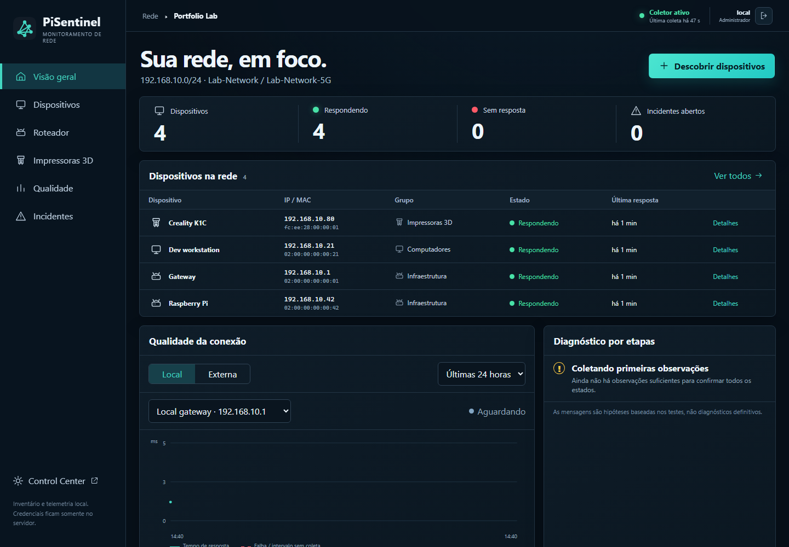
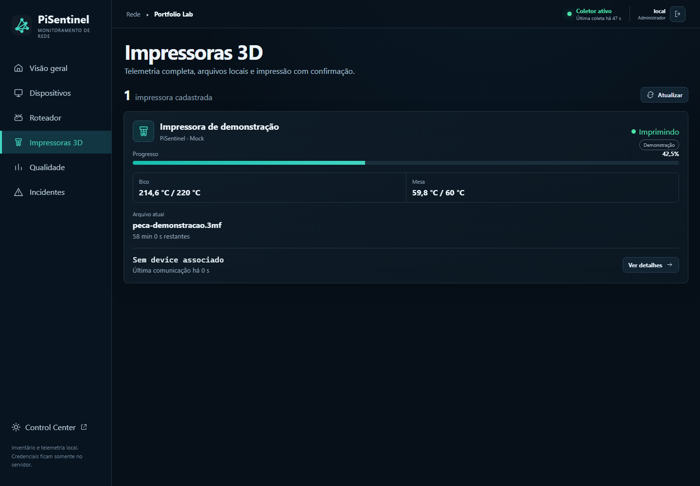
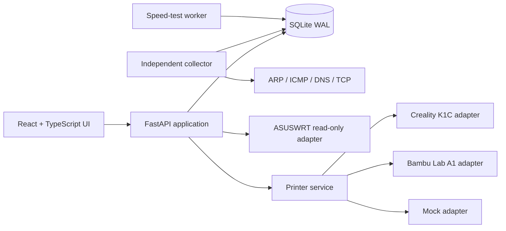

# PiSentinel

[](https://github.com/santosgus3dtech/pi-sentinel/actions/workflows/ci.yml)
[](https://www.python.org/)
[](https://react.dev/)
[](LICENSE)

PiSentinel is a self-hosted Raspberry Pi operations console for monitoring a local network and managing 3D printer telemetry from one responsive web interface. It combines a FastAPI backend, an independent network collector, SQLite WAL storage, and a React/TypeScript frontend.

This public repository is a sanitized portfolio edition. It contains no production database, credentials, device identifiers, or private network inventory.

## Screenshots





Both screens use synthetic portfolio data and the deterministic mock printer adapter.

## What it demonstrates

- Bounded IPv4 discovery with ARP, ICMP, DNS, and limited TCP service checks.
- Device inventory, vendor enrichment, custom labels, groups, availability history, and incidents.
- Read-only ASUSWRT telemetry with graceful degradation when the router is unavailable.
- Ookla speed-test scheduling, result history, and incident thresholds.
- A generic printer domain with adapters for Creality K1C, Bambu Lab A1, and deterministic mock data.
- Server-side credential isolation and certificate fingerprint validation for printer integrations.
- Local authentication, expiring sessions, role-aware responses, and same-origin checks.
- systemd deployment units for the API, collector, and speed-test worker.
- Responsive React/TypeScript UI for desktop and mobile operations.

## Architecture



The collector owns discovery and monitoring cycles. The API never launches a network scan directly; it only queues a request in SQLite. Printer failures are isolated per adapter so one unavailable device cannot take down the dashboard.

## Safety model

PiSentinel is designed for a trusted local network. It does not capture packets, extract credentials, exploit devices, or perform vulnerability scans.

Physical printer commands are disabled by default. A print preparation request is accepted only when all of these checks pass:

- authentication and same-origin browser access;
- explicit server-side enablement;
- compatible file and selected plate;
- printer state exactly `IDLE` or `COMPLETED`;
- literal confirmation text;
- final file, AMS, and printer-state revalidation.

Unknown, offline, printing, paused, or error states are rejected.

## Local development

Requirements: Python 3.11+, Node.js 20+, and npm.

```bash
python -m venv .venv
python -m pip install -r requirements-dev.txt

cd frontend
npm ci
npm run build
cd ..

python -m uvicorn pisentinel.api:app --host 127.0.0.1 --port 8090
```

Open `http://127.0.0.1:8090`. In a second terminal, run one safe collector cycle:

```bash
python -m pisentinel.collector --once
```

Copy `.env.example` to `.env` only for local configuration. Real credentials belong in an ignored environment file or service-level secret store, never in Git.

## Configuration

The deployment template in `deploy/pisentinel.env.example` uses documentation-only network values. Important switches include:

| Variable | Purpose | Default posture |
| --- | --- | --- |
| `PISENTINEL_AUTH_ENABLED` | Enables local session authentication | Disabled for development |
| `PISENTINEL_MOCK_PRINTER_ENABLED` | Adds deterministic mock printer data | Disabled |
| `PISENTINEL_PRINTER_CONTROLS_ENABLED` | Allows guarded print preparation | Disabled |
| `PISENTINEL_ROUTER_*` | Configures read-only router telemetry | Empty |
| `BAMBU_A1_*` | Configures the local Bambu integration | Empty |

See `docs/` for authentication, router telemetry, printer adapters, safe K1C discovery, speed tests, and interface design notes.

## Verification

```bash
python -m pytest -q -p no:cacheprovider
cd frontend && npm ci && npm run build
```

GitHub Actions runs both suites on every push and pull request.

## Deployment

Example systemd units are provided in `deploy/` for Raspberry Pi OS. The intended production layout is:

- application: `/opt/pi-sentinel`;
- persistent database: `/var/lib/pi-sentinel/pisentinel.db`;
- private configuration: `/etc/pi-sentinel/pisentinel.env`.

Production environments should run behind a trusted local reverse proxy or VPN, use authentication, protect configuration permissions, and keep printer controls disabled until deliberately configured.

## License

MIT. See [LICENSE](LICENSE).
